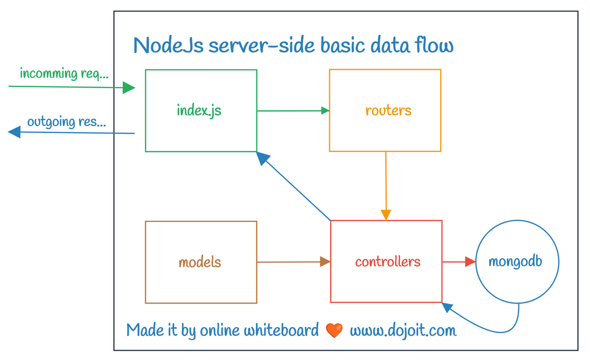
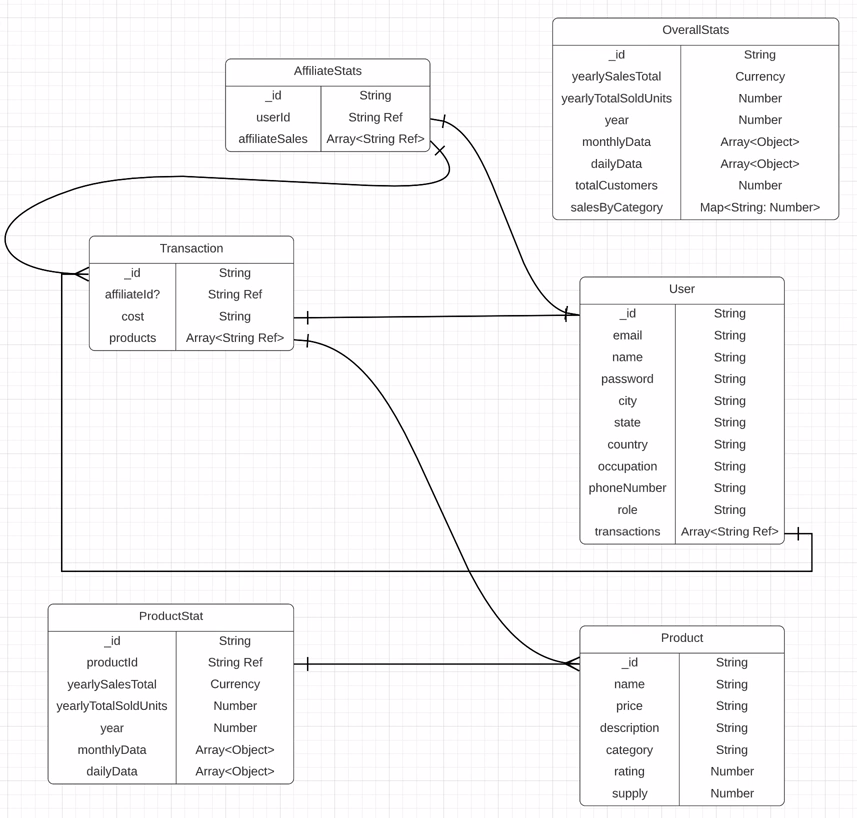

> 12 - Dec - 2022

# Admin Dashboard - MERN App | [Live Link](link)

## Frontend | lib used...
1. React
2. React Router Dom
3. React Date Picker
4. Redux Toolkit
5. Redux Persist
6. RTK Query (API calls)
7. Material UI
8. Nivo Charts 

## Backend | lib used...
1. Express-JS
2. Nodemon
3. Dotenv
4. Cors
5. Helmet
6. Body Parser
7. Mongoose
8. Morgan

 

## ReactJs | Frontend Basic Data Flow...

 

## NodeJs | Backend Basic Data Flow...

 

## Entity Relationship Diagram for Data Model 

 

## App Deployment System

<!-- 
https://github.com/ed-roh/fullstack-admin
-->